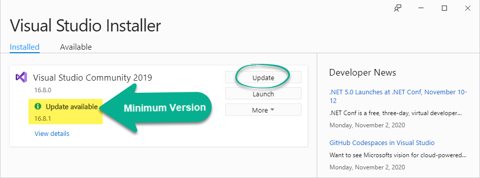

# DMIT-2018 - **Workbook** (Sep 2021)

> **STUDENT_NAME** - Place your name in this line.

This repository is your **Student Workbook** for participating in the in-class demos and for completing practice homework; the coding work is to be placed in the [*`src/`*](./src/ReadMe.md) folder. Learning Outcomes ([**LOGs**](./docs/logs/ReadMe.md)) and other useful notes can be found in the [**docs** folder](./docs), such as links to the [Reading Materials](./docs/Readings.md) for the course. Also, you are encouraged to use the [**docs/mynotes**](./docs/mynotes/ReadMe.md) folder to record your notes from each class.

> :warning: **Do *NOT*** use this repository for any assignments that are worth marks. For work worth marks in this course, only use repositories set up/approved by your instructor. :warning:

Additionally, you can find online notes at the course's [Moodle site](https://moodle.nait.ca) and on the unofficial [website notes](https://dmit-2018.github.io). Also be sure to checkout out the topical [**Learning Outcomes**](https://dmit-2018.github.io/about/LOGs.html) used in class.

----

##  Version Control

At the end of the term, your repositories on this [DMIT-2018 GitHub Organization](https://github.com/DMIT-2018) will be removed. You will still have access to your local versions of these repositories for your personal use and review.

> :warning: **Do *NOT*** re-publish your assignment/assessment repositories - doing so with any materials worth marks is an act of academic dishonesty :warning:

----

##  Software & Resources

**Required** books, videos, tools, etc. for this course include:

- [Visual Studio 2019, Community Edition](https://visualstudio.microsoft.com/) (see [Notes](#vs-2019-community) on the minimum version)
- [SQL Server 2019](https://www.microsoft.com/sql-server/sql-server-downloads) or higher, **Developer Edition**
- [SQL Server Management Studio](https://docs.microsoft.com/sql/ssms/download-sql-server-management-studio-ssms?view=sql-server-ver15#download-ssms) (*SSMS*)

Recommended tools for this course include:

- [GitHub CLI](https://cli.github.com/) (*Command-Line Interface*)
- [Visual Studio Code](https://code.visualstudio.com) (see [Notes]() on VS Code extensions)
- Draw.io ([desktop](https://about.draw.io/integrations/#integrations_offline) and [online](https://draw.io) versions)

Other recommended resources include:

- [Learn Markdown](https://commonmark.org/help/)
- [Programming Fundamentals - An Object-Oriented Introduction to Programming in C#](https://programming-0101.github.io/TheBook/)

Advanced resources outside the scope of this course include:

- [Azure Developer Tools](https://azureforeducation.microsoft.com/devtools) - Sign in with your school-issued email address to get access to the free resources offered by Microsoft.

----

### VS 2019 Community

You need to be running version 1.16.8 or higher of Visual Studio 2019 in order to use [**.Net 5.0**](https://dotnet.microsoft.com/platform/support/policy/dotnet-core). If you need to upgrade, launch the Visual Studio Installer and upgrade through that tool.

> The current version of VS 2019 at the start of this term is **16.11.2**

|  |  |
|--------------------------------------------------------|----------------------------------------------------------------------|

You also should ensure you have the required workflows and components for this course.

| Required Workflows | Recommended Workflows | Individual Components |
|--------------------|-----------------------|-----------------------|
|  |  |  |
|  |  | |
| |  | |
| |  | |
| |  | |

----
