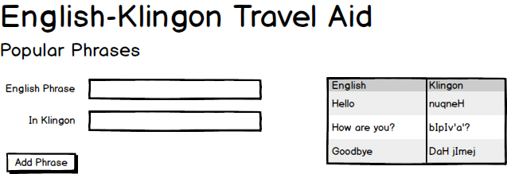

# ASP.NET Core 

> Begin this lesson by moving this folder into the [`src\`](../../src/) folder.

----

## English Klingon Dictionary

Follow along with your instructor in creating the following demo.

> 
>
> *leng tlhIngan tera' mu'ghom*

Create a Visual Studio solution that produces the following form.

The Visual Studio solution should

- Use a class called **`Translation`**
- Maintain the translations in a static `List<T>`
- Show the current translations in a table on the side of the page.

Test your application using information from tools such as the [Klingon Pocket Dictionary](http://klingonska.org/dict/) or the [How do I say...?](http://klingon.wiki/En/HowDoISay) list of phrases from the Klingon Wiki.

With practice, you can become a [***po'wI'***](http://klingon.wiki/En/RobynStewart) (expert).

> [*Heghlu'meH QaQ jajvam.*](http://klingon.wiki/En/TodayIsAGoodDayToDie)
