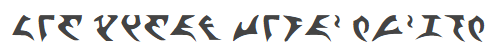

# ASP.NET Core 

> Begin this lesson by moving this folder into the [`src\`](../../src/) folder.

----

## English Klingon Dictionary

Follow along with your instructor in creating the following demo.

> 
>
> *leng tlhIngan tera' mu'ghom*

Create a Visual Studio solution that produces the following form.

The Visual Studio solution should

- Include appropriate navigation menus
- Use a class called **`Translation`**
- Show the current translations in a table on the side of the page.
