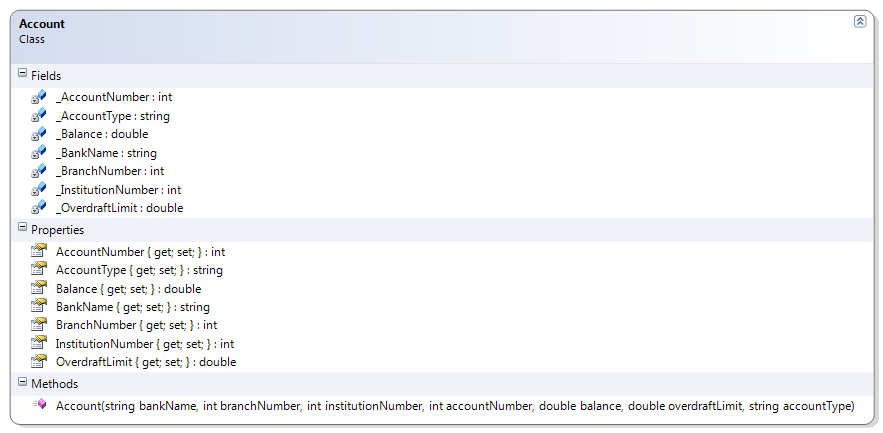
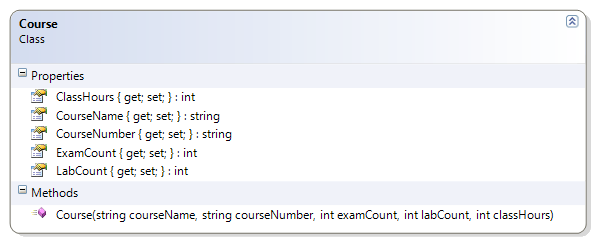
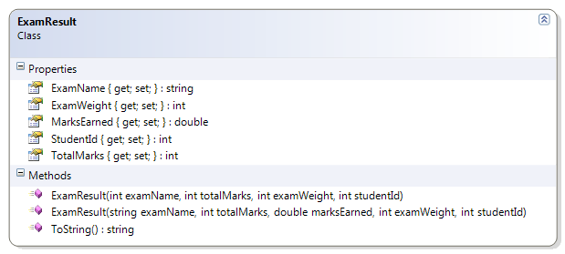

# Starting with Classes - Part C

> As you move through each of the code examples and practice problems, be sure to **commit** your edits **frequently**.

## Demos

In these demos, the code is given to you. Integrate this code into the Topic project of the ABCs solution under the `C` folder. Be sure to wrap each class under the `Topic.C` namespace.

### `Person` Class

This simple class illustrates and introduces the idea of encapsulation (private fields with public properties). This example does not have a constructor. This example includes a driver. The driver is also used to illustrate how, with only fields & getter/setter methods, an object can be in an "unknown" (and invalid) state as soon as it is created; this idea is introduced to show the need for a constructor, and opens the discussion of the idea of a "default constructor".

```csharp
public class Person
{
    public string _FirstName;
    public string _LastName;
    public int _Age;

    public string FirstName
    {
        get { return _FirstName; }
        set { _FirstName = value; }
    }
    public string LastName
    {
        get { return _LastName; }
        set { _LastName = value; }
    }
    public int Age
    {
        get { return _Age; }
        set { _Age = value; }
    }
}
```

----

### `Account` Class

This simple class also illustrates encapsulation, but with one of the fields being read-only. This necessitates the presence of a constructor. This example includes a driver which shows that a class is in a "known state" as soon as it is created.

```csharp
public class Account
{
    public readonly int AccountNumber;
    private double _Balance;
    private double _OverdraftLimit;

    public double Balance
    {
        get { return _Balance; }
        set { _Balance = value; }
    }

    public double OverdraftLimit
    {
        get { return _OverdraftLimit; }
        set { _OverdraftLimit = value; }
    }

    public Account(int accountNumber, double balance, double overdraftLimit)
    {
        AccountNumber = accountNumber;
        Balance = balance;
        OverdraftLimit = overdraftLimit;
    }
}
```

```csharp
public static void Main(string[] args)
{
    Account savings = new Account(7654321, 100, 200);
    Console.WriteLine($"Account # {savings.AccountNumber} has a balance of ${savings.Balance}");
}
```

----

### `Student` Class

This class reinforces the idea of encapsulation and constructors. It also introduces the idea of overloading the default ToString() method that every class inherits from the Object class. This example includes a driver with multiple objects, showing how the use of constructors makes it easier to create many objects in a few lines of code.

```csharp
public class Student
{
    public readonly string Name;
    public readonly char Status;
    public readonly int StudentId;
    public string _Program;
    public double _GradePointAverage;
    public bool _IsFullTime;

    public string Program
    {
        get { return _Program; }
        set { _Program = value; }
    }
    public double GradePointAverage
    {
        get { return _GradePointAverage; }
        set { _GradePointAverage = value; }
    }
    public bool IsFullTime
    {
        get { return _IsFullTime; }
        set { _IsFullTime = value; }
    }

    public Student(string name,
                   char status,
                   int studentId,
                   string program,
                   double gradePointAverage,
                   bool isFullTime)
    {
        Name = name;
        Status = status;
        StudentId = studentId;
        Program = program;
        GradePointAverage = gradePointAverage;
        IsFullTime = isFullTime;
    }

    public override string ToString()
    {
        return $"({StudentId}) {Name}";
    }
}
```

```csharp
public static void Main(string[] args)
{
    Student jack = new Student("Jack Hill", 'M', 123456, "Programming 101", 3.72, true);
    Student jill = new Student("Jill Roland", 'F', 144721, "Programming 101", 3.80, true);

    Console.WriteLine($"{jack} has a GPA of {jack.GradePointAverage}");
    Console.WriteLine($"{jill} has a GPA of {jill.GradePointAverage}");
}
```

----

### `Company` and `Employee` Classes

These are other classes similar to the Person and Student classes, but the Employee class uses Auto-Implemented properties (available since C# 3.0). Lastly, these classes "share" a driver, illustrating the fact that any given "program" typically uses more than one class.

```csharp
public class Company
{
    public string Name { get; set; }
    public string City { get; set; }
    public bool IsIncorporated { get; set; }
    public DateTime BusinessStartDate { get; set; }
    public double GrossIncomeToDate { get; set; }

    public Company(string name,
                    string city,
                    bool isIncorporated,
                    DateTime businessStartDate,
                    double grossIncomeToDate)
    {
        Name = name;
        City = city;
        IsIncorporated = isIncorporated;
        BusinessStartDate = businessStartDate;
        GrossIncomeToDate = grossIncomeToDate;
    }
}
```

```csharp
    public class Employee
    {
        public string FirstName { get; set; }
        public string LastName { get; set; }
        public int SocialInsuranceNumber { get; set; }
        public double YearlySalary { get; set; }
        public DateTime EmploymentStartDate { get; set; }
        public char Gender { get; set; }

        public Employee(string firstName,
                        string lastName,
                        int socialInsuranceNumber,
                        double yearlySalary,
                        DateTime employmentStartDate,
                        char gender)
        {
            FirstName = firstName;
            LastName = lastName;
            SocialInsuranceNumber = socialInsuranceNumber;
            YearlySalary = yearlySalary;
            EmploymentStartDate = employmentStartDate;
            Gender = gender;
        }
    }
```

```csharp
public static void Main(string[] args)
{
    Company jdCompany = new Company("JD Consulting", "Edmonton", true, new DateTime(2012, 5, 15), 785646.45);
    Employee johnDoe = new Employee("John", "Doe", 123456789, 92500, new DateTime(2012, 5, 15), 'M');
    Employee analyst = new Employee("Anna", "Lyst", 112258899, 74500, new DateTime(2014, 7, 1), 'F');
    Employee student = new Employee("Stewart", "Dent", 314259876, 52000, new DateTime(2015, 5, 20), 'M');

    Console.WriteLine($"{jdCompany.Name} employs {johnDoe.FirstName}, {analyst.FirstName} and {student.FirstName}");
}
```

----
----

## Practice

Integrate these practice problems into the code under the `C` folder. Some of these problems introduce changes to code you've already written while others represent new classes.

### `Person` Modifications

This simple class illustrates and introduces the idea of encapsulation (private fields with public properties). This example uses a constructor for ensuring the state of an object when it is instantiated (created).

Extend the Person class from the example to include a constructor that takes in a first and last name as well as an age in the parameter list.


----

### `Account` Modifications

Extend the Account class from the example to include more information.

**Problem Statement:**

Extend the Account class from the example to include more information. Specifically, include an AccountType:String, BankName:String, BranchNumber:Integer, and InstitutionNumber:Integer. Base your solution on the following class diagram.



Also modify the driver to make use of the added information.

----

### `Course` Class

This class represents a post-secondary course with a theory (exam) and a lab portion.

**Problem Statement:**

Create the Course class so that it represents a post-secondary course. Design the class to have auto-implemented properties and a constructor as specified in this class diagram. Note that the auto-implemented properties should have their "set" implementations marked as private.



Also create a driver for testing this class; you may use any name for your driver as long as it is not already mentioned in this namespace. In the driver, instantiate all of the first term classes you are taking and populate those objects with data (use hard-coded data).

----

### `ExamResult` Modifications

This class represents the results of an exam for a student.

**Problem Statement:**

Create the ExamResult class so that it represents the results of an exam written by a student. Design the class to have the properties and constructors as specified in this document. (Note that there are two constructors for this class.) Also create a ToString( ) method that describes the information in any given instance of this class.

Use auto-implemented properties for the entire class. Note that only the following properties should have private "set" implementations: TotalMarks, ExamName, ExamWeight, and StudentId.



Also create a driver for testing this class; you may use any name for the driver as long as it is not already mentioned in this namespace. In the driver, instantiate all of the exams you have taken to date in this course and populate those objects with data (use hard-coded data); if you need to, you may create fake data for the driver.

----

### `LabResult` Modifications

This class represents the results of a lab for a student.

**Problem Statement:**

Create the LabResult class so that it represents the results of a lab submitted by a student. Design the class to have the fields, properties, and constructor as specified in this document. Also create a ToString() method that describes the information in any given instance of this class.

Use an auto-implemented property for the MarksEarned; use fields as the "backing store" for all other properties.

Note that the following properties should not have "set" implementations: TotalMarks, LabNumber, LabWeight, and StudentId.


Here are some XML comments to describe the ToString( ) method.

```csharp
/// <summary>
/// This method overrides the default ToString() method to display
/// more meaningful information about this object.
/// </summary>
/// <returns>A string displaying the StudentId, MarksEarned, and
/// TotalMarks.</returns>
/// <remarks>
/// A call to this method (such as <c>Lab4.ToString()</c>)
/// would produce the following result:
/// <code>The student (200702694) received 24.5/35 for this lab.</code>
/// </remarks>
```

Also create a driver for testing this class; you may use any name for the driver as long as it is not already mentioned in this namespace. In the driver, instantiate all of the labs you have submitted to date in any course and populate those objects with data (use hard-coded data); if you haven't had any labs as of yet, then make up some data.
