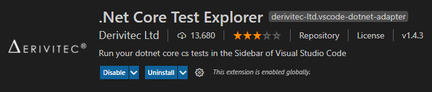

# Testing and Debugging

When we write code, we do so with expectations of what our program will do. We want our program to behave a certain way when working with certain information so as to produce certain outcomes.

> *A computer program is a **set of instructions** for manipulating **information**.*

But our programs don't always do what we want them to. Certainly, they will do what we've told them to do, but we as programmers don't always say what we mean to say.

**Debugging** is all about finding out what our programs are actually doing. We *pause* our code's execution so that we can inspect what's going on inside of our program. We do this so that we can track down the reasons our code is doing something other than what we want it to do.

**Testing** is a little bit different - it's about seeing what our program is doing and *comparing* that to what we want them to do. The subtle difference here is that we *already have an outcome in mind* and we aim to *compare* and *contrast* that with what our program actually produces. Since our goal is to compare and contrast, we can effectively *write code* that will automatically do that testing for us. This **automated testing** is markedly different from *manual* testing where we simply run our program by hand and gaze at the screen as we enter data and watch for the output. It's also different from what happens when we're pausing our code in "debug mode" and stepping through each line we've written.

The difference between the definitions I'm proposing here for "Testing" and "Debugging" is that *debugging is **interactive*** while *testing is **static***. It's not about "either-or"; it's about "both-and". By combining automated tests with the skill of debugging, you will more quickly know when things are going wrong with your code, and why!

----

## Debugging Basics

Read [Debug an App](https://docs.microsoft.com/dotnet/core/tutorials/debugging-with-visual-studio-code) on Microsoft Docs.

- [ ] [**Run View**](https://code.visualstudio.com/docs/editor/debugging#_run-view) - `ctrl` + `shift` + `d`
  - [ ] [Setup for Terminal Access](https://docs.microsoft.com/dotnet/core/tutorials/debugging-with-visual-studio-code#set-up-for-terminal-input)
- [ ] [Debug Actions](https://code.visualstudio.com/docs/editor/debugging#_debug-actions)
  - [ ] Start / Continue / Pause
  - [ ] Step Over, Step Into, Step Out
  - [ ] Restart, Stop
- [ ] [Using Breakpoints](https://code.visualstudio.com/docs/editor/debugging#_breakpoints)
- [ ] [Logpoints](https://code.visualstudio.com/docs/editor/debugging#_logpoints)
- [ ] [Inspecting Variables](https://code.visualstudio.com/docs/editor/debugging#_data-inspection)
  - [ ] Locals and Watch
  - [ ] [Immediate Window (VS2019)](https://docs.microsoft.com/visualstudio/ide/reference/immediate-window?view=vs-2019) and [Debug Console REPL (VS Code)](https://code.visualstudio.com/docs/editor/debugging#_debug-console-repl)
    - [ ] [5 Tricks You Should Know About Visual Studio's Immediate Window](https://oz-code.com/blog/visual-studio-extension/using-immediate-window-debug-code-design-time)
- [ ] Stack Trace

----

## A Peek Into Automated Testing

- [ ] Fraction demo, with .ToString() and .Reciprocal
- [ ] [xUnit and VS Code](https://xunit.net/docs/getting-started/netcore/cmdline)

> For a side-bar visual look at your unit tests, you can try the [.Net Core Test Explorer](https://marketplace.visualstudio.com/items?itemName=derivitec-ltd.vscode-dotnet-adapter) extension.
>
> 

----

## The Problem of Testing Your Code When You Are Still Learning To Code

How can you write automated tests of your code if you're still just learning how to code in the first place? The short answer is, "You can't."

## The Joy of Testing Your Code As You Are Learning To Code

How can you write automated tests of your code if you're still just learning how to code in the first place? The short answer is, "You don't have to if *someone has written the tests for you*." You get to focus on learning how to code while the tests run in the background to let you know what's working and what isn't.
