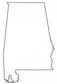
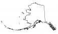
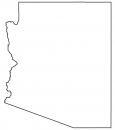
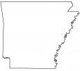
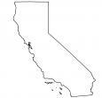
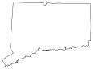
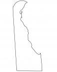
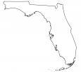
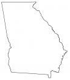
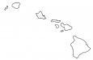

# Images

## State Outline Maps

|  |  |  |  |  |
|--|--|--|--|--|
| **Alabama**    | **Alaska**    | **Arizona**    | **Arkansas**    | **California**    |
| **Colorado**    | **Connecticut**    | **Delaware**    | **Florida**    | **Georgia**    |
| **Hawaii**    | **Idaho**    | **Illinois**     | **Indiana**    | **Iowa**    |
| **Kansas**    | **Kentucky**    | **Louisiana**    | **Maine**    | **Maryland**    |
| **Massachusetts**    | **Michigan**    | **Minnesota**    | **Mississippi**    | **Missouri**    |
| **Montana**    | **Nebraska**    | **Nevada**    | **New Hampshire**    | **New Jersey**    |
| **New Mexico**    | **New York**    | **North Carolina**    | **North Dakota**    | **Ohio**    |
| **Oklahoma**    | **Oregon**    | **Pennsylvania**    | **Rhode Island**    | **South Carolina**    |
| **South Dakota**    | **Tennessee**    | **Texas**    | **Utah**    | **Vermont**    |
| **Virginia**    | **Washington**    | **West Virginia**    | **Wisconsin**    | **Wyoming**    |

----

> Credits:
>
> - Individual State Maps: https://gisgeography.com/state-outlines-blank-maps-united-states/
> - USA/Canada Map: http://holidaymapq.com/map-of-u-s-and-canada/