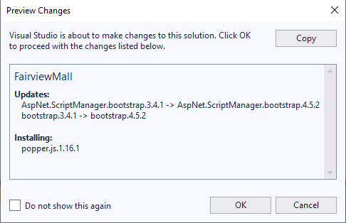

# Bootstrap Notes

## Migrating Bootstrap from 3.x to 4.x



When upgrading the Nuget packages for Bootstrap from version 3.x to 4.x, you will need to make adjustments to the navbar code in the `Site.master` file. Here's a sample of what it should look like in Bootstrap 4.x.

```html
<nav class="navbar navbar-expand-md navbar-dark fixed-top bg-dark">
    <a class="navbar-brand" runat="server" href="~/">Application name</a>
    <button type="button" class="navbar-toggler" data-toggle="collapse" data-target="#navbarCollapse">
        <span class="navbar-toggler-icon"></span>
    </button>
    <div class="collapse navbar-collapse" id="navbarCollapse">
        <ul class="navbar-nav mr-auto">
            <li class="nav-item"><a class="nav-link" runat="server" href="~/">Home</a></li>
            <li class="nav-item"><a class="nav-link" runat="server" href="~/About">About</a></li>
            <li class="nav-item"><a class="nav-link" runat="server" href="~/Contact">Contact</a></li>
        </ul>
        <asp:LoginView runat="server" ViewStateMode="Disabled">
            <AnonymousTemplate>
                <ul class="nav navbar-nav navbar-right">
                    <li class="nav-item"><a class="nav-link" runat="server" href="~/Account/Register">Register</a></li>
                    <li class="nav-item"><a class="nav-link" runat="server" href="~/Account/Login">Log in</a></li>
                </ul>
            </AnonymousTemplate>
            <LoggedInTemplate>
                <ul class="nav navbar-nav navbar-right">
                    <li class="nav-item"><a class="nav-link" runat="server" href="~/Account/Manage" title="Manage your account">Hello, <%: Context.User.Identity.GetUserName()  %> !</a></li>
                    <li>
                        <asp:LoginStatus runat="server" LogoutAction="Redirect" LogoutText="Log off" LogoutPageUrl="~/" OnLoggingOut="Unnamed_LoggingOut" />
                    </li>
                </ul>
            </LoggedInTemplate>
        </asp:LoginView>
    </div>
</nav>
```

You may also want to adjust the markup for the main div and footer to be as follows.

```html
        <main role="main" class="container body-content">
            <div>
                <asp:ContentPlaceHolder ID="MainContent" runat="server">
                </asp:ContentPlaceHolder>
            </div>
        </main>
        <hr />
        <footer>
            <p>&copy; <%: DateTime.Now.Year %> - My ASP.NET Application</p>
        </footer>
```
